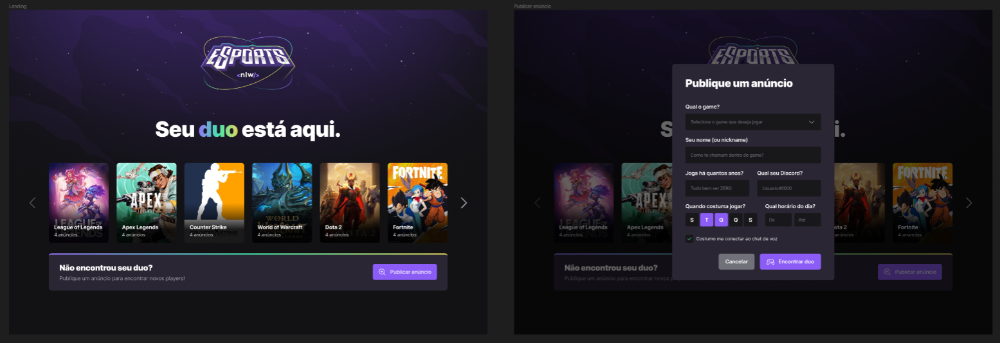
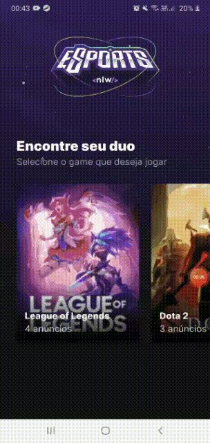

# Projeto NLW Esports - React JS | React Native | Node JS

### Demo Web


### Demo Mobile



#Índice
- [Demo](#️##demo)
- [ About the project](##about-the-project)
- [🚀 Technologies used in this project](#-tecnologias-utilizadas-neste-projeto)
- [📥 How About](#-como-usar)
- [🚀 Author](#-autor)


## About the project
Este é um projeto desenvolvido no evento NLW da Rocketseat (NLW Esports), onde neste evento foi adquirido os seguintes conhecimentos:

BACKEND
- Node JS
- Express
- Vite js

FRONTEND
- React Native
- TypesScript
- Tailwind CSS

MOBILE
- React Native
- Expo


- Dentre muitos outros conhecimentos...


---

## Passo a passo do desenvolvimento do projeto

### 1 - Configuração do ambiente NodeJS

Criar uma pasta para seu projeto com nome de nlw/server.

- npm init -y
- npm install express -D
- npm install @types/express -D
- criar a pasta src/server.ts e adicionar o seguinte código

- No server.ts fica assim:
```js
import express,{Request, Response} from 'express'

const app = express()

app.get('/ads', (request:Request, response:Response)=>{
    return response.json([
        {id:1, name: 'anuncio1'},
        {id:2, name: 'anuncio2'},
        {id:3, name: 'anuncio3'},
    ])
})

app.listen(3333)
```

-no package.json fica assim:
```js
{
  "name": "server",
  "version": "1.0.0",
  "description": "",
  "main": "src/server.js",
  "scripts": {
    "build": "tsc",
    "dev":"ts-node-dev src/server.ts"
  },
  "keywords": [],
  "author": "",
  "license": "ISC",
  "dependencies": {
    "@types/express": "^4.17.13",
    "express": "^4.18.1"
  },
  "devDependencies": {
    "ts-node-dev": "^2.0.0",
    "typescript": "^4.8.3"
  }
}


```
- no tsconfig.json alterar para o seguinte: 
"module": "CommonJS",       
"rootDir": "./src",
"outDir": "./build",
"moduleResolution": "node",     

- npm i ts-node-dev -D

- no console: npx tsc --init
- no navegador: http://localhost:3333/ads
- no console: npm run build (este arquivo gera o arquivo server.JS, na pasta build)

-----
### Configuração do ambiente frontend - React JS
Sair da pasta server e na raiz do projeto dar o seguinte comando:

```js
npm create vite@latest
```
- Nome do projto web
- Template: React
- Variant: Typescript

Entra na pasta web e abre no vscode com "code ."(sem as aspas, claro)

```js
npm install
```

### Configuração do ambiente mobile - React Native

```js
npm install --global expo-cli
```

```js
expo init mobile
```
- blank(typescript)

Depois de criado o projeto, acessar a pasta mobile e abrir no VSCODE
Abrir o emulador antes de abrir o projeto e:
- expo start


----


## 🚀 Sobre mim
I'm a Javascript Developer, know me in:
- www.tayserosa.dev
- www.github.com/tayserosa
- www.linkedin.com/in/tayse-rosa


## 🔗 Links
[](https://www.tayserosa.dev/)
[](https://www.linkedin.com/in/tayse-rosa-3b683151/)


